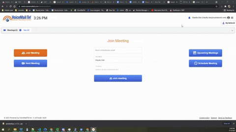

# meet-vmt-api

## Instructions ##
* URL Documentation Swagger:
    1. Copy api-descriptor.yaml content.
    2. Go to https://editor.swagger.io
    3. Paste api-descriptor.yaml content in the editor for URL documentation.

* Get Api Key:
    1. Go to https://meet.voicemailtel.com/
    2. Log in with your account.
    3. Go to Your Profile (top right corner).
    4. Select API Key Icon.
    5. Generate Api Key (if already generated just copy it from the table).

